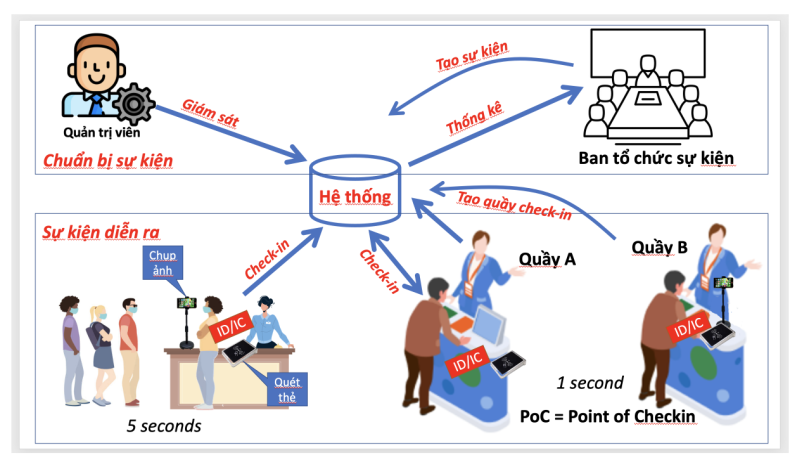

# GoCheckin - Hệ thống quản lí và hỗ trợ check in đa điểm



Hệ thống GoCheckin sẽ giúp bạn trong việc tổ chức và quản lí sự kiện nhiều điểm check in. Ngoài ra bạn cũng có thể sử dụng hệ thống để tham gia vào việc check in của sự kiện với nhiều tính năng đặc biệt, hay, hữu dụng như áp dụng học máy vào tự động quy trình check in bằng khuôn mặt, v.v..

## Table of Contents

- [Features](#features)
- [Tech Stack](#tech-stack)
- [Prerequisites](#prerequisites)
- [Installation](#installation)
- [Running the Application](#running-the-application)
- [Running with Docker](#running-with-docker)
- [API Documentation](#api-documentation)
- [License](#license)
- [Contact](#contact)

## Features

### Phía ban tổ chức

- Tổ chức sự kiện
- Quản lí sự kiện
- Theo dõi sự kiện theo thời gian thực
- Hỗ trợ phân tích dữ liệu sự kiện

### Phía người tham gia check in

- Check in tự động bằng khuôn mặt và thẻ quẹt
- Đăng kí tham gia sự kiện
- Hỗ trợ phân tích dữ liệu sự kiện

## Tech Stack

**Frontend:**

- Nextjs
- TypeScript
- Zustand
- Tailwind CSS
- face-api.js (Face detection machine learning library)
- socketio

**Backend:**

- Nestjs
- Typescript
- Postgres, Redis
- Authentication with JWT
- socketio
- AWS S3

**DevOps:**

- Github
- Github action
- Docker
- AWS

## Prerequisites

Before you begin, ensure you have met the following requirements:

- You have installed the latest version of Nodejs, Git
- Install Docker if you want to run application with Docker .
- Registered AWS service

## Installation

Follow these steps to get your development environment set up:

1.  **Clone the repository:**

    ```bash
    git clone https://github.com/bk-leducphuong/GoCheckin.git
    cd GoCheckin
    ```

2.  **Install frontend dependencies:**

    ```bash
    cd frontend # or your frontend directory
    npm install # or yarn install
    ```

3.  **Install backend dependencies:**

    ```bash
    cd backend # or your backend directory
    npm install # or yarn install or pip install -r requirements.txt etc.
    ```

4.  **Set up environment variables:**

    Create a `.env.development` file in the root of your project (and/or in `frontend` and `backend` directories if needed).
    Copy the contents of `.env.example` (if provided) into `.env.development` and fill in the necessary values.

    Example `.env.development` for backend:

    ```
    PORT=3001
    NODE_ENV=development
    CLIENT_URL=http://localhost:3000
    ```

    Example `.env.development` for frontend:

    ```
    NEXT_PUBLIC_API_URL=http://localhost:3001/api
    ```

## Running the Application

1.  **Start the backend server:**

    ```bash
    cd backend # or your backend directory
    npm start # or yarn dev or python app.py etc.
    ```

    The backend server should now be running on `http://localhost:PORT` (e.g., `http://localhost:3001`).

2.  **Start the frontend development server:**

    ```bash
    cd frontend # or your frontend directory
    npm start # or yarn dev
    ```

    The frontend application should now be running on `http://localhost:3000` (or another port specified by your frontend setup).

3.  **Running tests (optional):**

    To run tests for the frontend:

    ```bash
    cd frontend
    npm test # or yarn test
    ```

    To run tests for the backend:

    ```bash
    cd backend
    npm test # or yarn test or pytest etc.
    ```

## Running with Docker

You can easily run project with Docker:

    cd docker
    cp .env.example .env
    ./dev-start.sh

## API Documentation

Link to your API documentation (e.g., Swagger/OpenAPI, Postman collection).

Example:

The API is documented using Swagger. You can access the interactive documentation at `http://localhost:PORT/api-docs` once the backend server is running.

Alternatively, you can provide a brief overview of key endpoints here:

### Endpoints

- **GET /api/users** - Get all users
- **POST /api/users** - Create a new user
- **GET /api/users/:id** - Get a user by ID
- ...

## License

This project is licensed under the MIT License - see the [LICENSE.md](./LICENSE.md) file for details.

## Contact

Le Duc Phuong - [@My_X](https://x.com/PhngLc66337009) - phuongtroc2004@gmail.com

Project Link: [GoCheckin](https://github.com/bk-leducphuong/GoCheckin)
